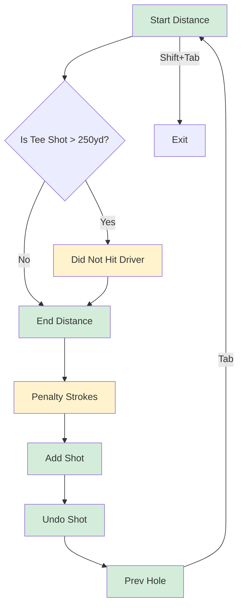

# Desktop Tab Key Navigation Enhancement Plan

## Overview
Add desktop-friendly Tab key navigation to the shot entry form, allowing users to efficiently navigate through all form fields using just the keyboard.

## Current State Analysis

### Current Focusable Elements (in DOM order)
1. `startDistance` input (line 1235) - has `ref={startDistanceRef}`
2. "Did not hit Driver" checkbox (line 1273) - conditional, only when `isTeeShotOver250`
3. `endDistance` input (line 1286) - has `ref={endDistanceRef}`, handles Enter key
4. Penalty checkbox (line 1340)
5. Lie selector buttons (line 822-831) - 6 buttons (Tee, Fairway, Rough, Sand, Recovery, Green)
6. Add Shot button (line 1350)
7. Undo Shot button (line 1360)
8. Prev Hole button (line 1363)

### Issue
- No explicit Tab key handling exists
- Standard browser Tab behavior may not follow the logical flow the user wants
- "Did not hit Driver" checkbox is conditionally rendered, which breaks standard Tab order when hidden

## Desired Tab Order

```
1. Starting Distance (input#startDistance)
2. Did Not Hit Driver (checkbox) - SKIP if not visible (tee shot > 250 yards)
3. Ending Distance (input#endDistance)
4. Penalty Strokes (checkbox)
5. Add Shot (button)
6. Undo Shot (button)
7. Prev Hole (button)
```

## Implementation Strategy

### 1. Add refs for all focusable elements
```javascript
const startDistanceRef = useRef(null);      // existing
const endDistanceRef = useRef(null);          // existing
const didNotHitDriverRef = useRef(null);     // NEW
const penaltyRef = useRef(null);              // NEW
const addShotBtnRef = useRef(null);          // NEW
const undoShotBtnRef = useRef(null);         // NEW
const prevHoleBtnRef = useRef(null);          // NEW
```

### 2. Create a unified keydown handler
Create a function that handles Tab navigation for all relevant elements:

```javascript
const handleTabKeyDown = (event, currentField) => {
    // Determine next field based on current field and conditions
    const fields = getOrderedFields(); // returns array of field refs in Tab order
    
    // Check if "Did not hit driver" should be included
    const includeDidNotHitDriver = isTeeShotOver250;
    
    // Find current index and calculate next
    // Prevent default Tab behavior and manually focus next element
};
```

### 3. Field Order Logic
```javascript
const getOrderedFieldRefs = () => {
    const fields = [startDistanceRef];
    
    if (isTeeShotOver250) {
        fields.push(didNotHitDriverRef);
    }
    
    fields.push(
        endDistanceRef,
        penaltyRef,
        addShotBtnRef,
        undoShotBtnRef,
        prevHoleBtnRef
    );
    
    return fields;
};
```

### 4. Attach refs to elements

#### Start Distance Input
```jsx
<input
    id="startDistance"
    ref={startDistanceRef}
    onKeyDown={(e) => handleFieldKeyDown(e, 'startDistance')}
/>
```

#### Did Not Hit Driver Checkbox
```jsx
<label className="shot-options-toggle" ref={didNotHitDriverRef}>
    <input 
        ref={didNotHitDriverRef}
        onKeyDown={(e) => handleFieldKeyDown(e, 'didNotHitDriver')}
/>
```

#### End Distance Input
```jsx
<input
    id="endDistance"
    ref={endDistanceRef}
    onKeyDown={(e) => handleFieldKeyDown(e, 'endDistance')}
/>
```

#### Penalty Toggle
```jsx
<label className="penalty-toggle" ref={penaltyRef}>
    <input 
        ref={penaltyRef}
        onKeyDown={(e) => handleFieldKeyDown(e, 'penalty')}
/>
```

#### Action Buttons
```jsx
<button ref={addShotBtnRef} onKeyDown={(e) => handleFieldKeyDown(e, 'addShot')}>
<button ref={undoShotBtnRef} onKeyDown={(e) => handleFieldKeyDown(e, 'undoShot')}>
<button ref={prevHoleBtnRef} onKeyDown={(e) => handleFieldKeyDown(e, 'prevHole')}>
```

### 5. Handle Shift+Tab (Reverse Navigation)
- When Shift+Tab is pressed, navigate to the previous field
- At first field, allow browser default (move out of form)

### 6. Handle Enter key on Add Shot button
- Keep existing Enter key behavior on endDistance (submit form)
- Add Enter key handling on Add Shot button to trigger shot submission

## Edge Cases to Handle

1. **"Did not hit Driver" hidden**: When tee shot ≤ 250 yards, Tab should skip this checkbox
2. **End of form**: When on "Prev Hole" button, Tab should cycle to start or allow default browser behavior
3. **Start of form**: Shift+Tab from "Starting Distance" should allow default browser behavior
4. **Disabled fields**: Start distance may be disabled on subsequent shots - skip in Tab order
5. **Empty required fields**: Tab navigation should still work even if required fields are empty

## Mermaid Diagram - Tab Flow



## Files to Modify

1. **index.html** - Single file React application
   - Add new ref variables (around line 868)
   - Add `handleTabKeyDown` function (around line 970)
   - Add `ref` attributes to all focusable elements
   - Add `onKeyDown` handlers to all focusable elements
   - Update conditional rendering for "Did not hit Driver" to include ref

## Implementation Order

1. Add ref declarations for all new elements
2. Create `handleTabKeyDown` function with field ordering logic
3. Add ref and onKeyDown to "Did not hit Driver" checkbox
4. Add ref and onKeyDown to Penalty checkbox
5. Add ref and onKeyDown to Add Shot button
6. Add ref and onKeyDown to Undo Shot button
7. Add ref and onKeyDown to Prev Hole button
8. Test Tab and Shift+Tab navigation
9. Verify conditional skip of "Did not hit Driver" when hidden
